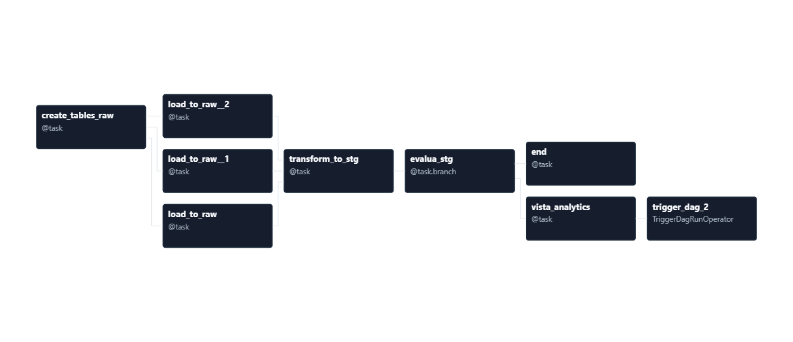
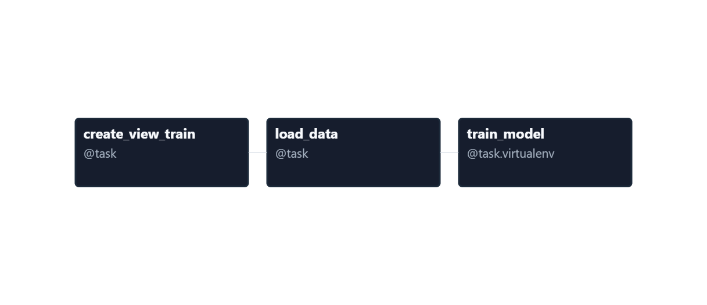
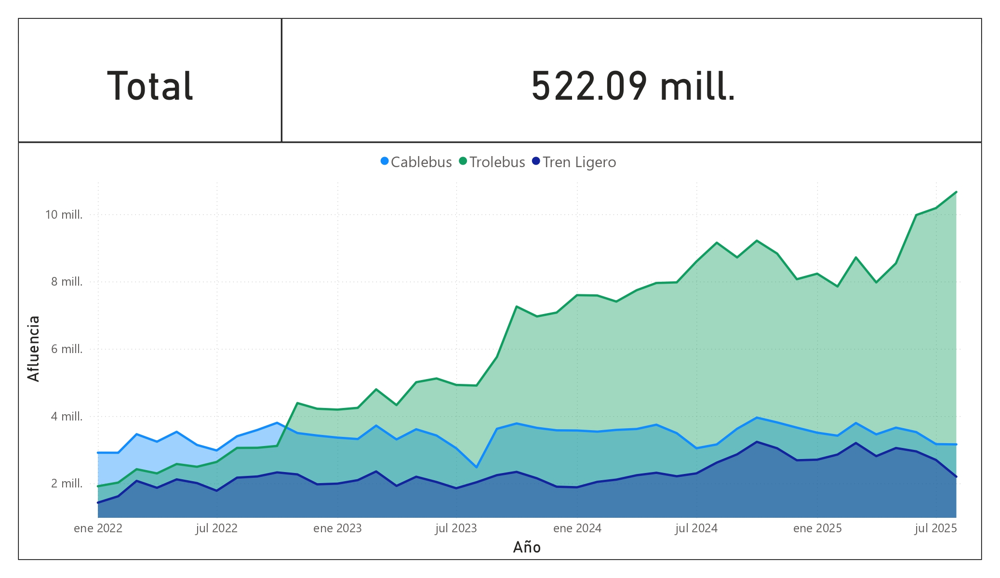
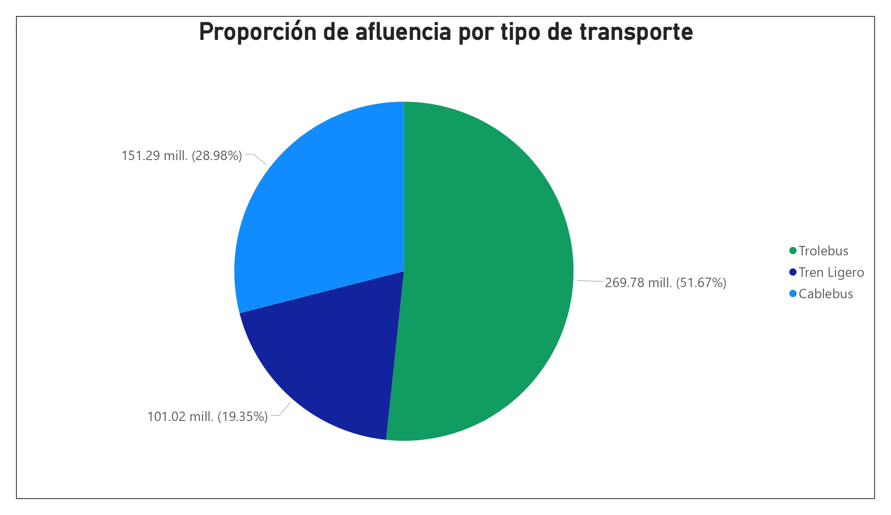

---

# 🚇 Proyecto de Pronóstico de Afluencia en Transporte Público

Este proyecto implementa un pipeline de datos para analizar y predecir la afluencia en tres sistemas de transporte público de la Ciudad de México: **Cablebús**, **Trolebús** y **Tren Ligero**.

El flujo completo incluye la orquestación de cargas, modelado de datos y entrenamiento de modelos de pronóstico, utilizando herramientas modernas del stack de datos.

---

## ⚙️ Arquitectura del Proyecto

**Tecnologías principales:**

* **Apache Airflow** → Orquestación de tareas ETL.
* **PostgreSQL** → Almacenamiento de datos brutos y transformados.
* **Minio** → Almacenamiento de objetos compatible con S3, utilizado para guardar modelos entrenados, artefactos de ML y otros archivos generados por el pipeline.
* **DBT (Data Build Tool)** → Creación de modelos *staging* y vistas analíticas.
* **scikit-learn (Random Forest)** → Modelo de pronóstico de afluencia.
* **MLflow** → Seguimiento y versionado de experimentos de *machine learning*.

---

## 🧩 Flujo de Trabajo

1. **Ingesta de datos** <br>
   Airflow extrae datos de afluencia de las tres fuentes de transporte y los carga en PostgreSQL.

2. **Transformación de datos** <br>
   dbt procesa las tablas *raw* para generar modelos *staging* y vistas limpias listas para análisis.

3. **Modelado predictivo** <br>
   Se entrena un modelo de *Random Forest* para estimar la afluencia futura en cada servicio.

4. **Monitoreo de experimentos** <br>
   MLflow registra métricas, versiones de modelos y parámetros de entrenamiento para facilitar el seguimiento.
Aquí tienes una versión mejor redactada y más fluida del texto, manteniendo el estilo técnico y claro:

---

## 🖼️ Visualización de Pipelines en Airflow

A continuación se presentan las vistas de los **DAGs implementados en Airflow**, los cuales orquestan los distintos procesos del flujo de datos.

### 🔹 DAG ELT

El siguiente gráfico muestra el **DAG `afluencia_elt`**, encargado de coordinar las tareas de **ingesta, transformación y modelado de datos**:

<div style="max-width: 100%; text-align: center;">
   
   <br>
   DAG afluencia_elt
</div>

### 🔹 DAG de Entrenamiento de Modelo

En la siguiente vista se observa el **DAG `afluencia_ml_train`**, responsable del **entrenamiento del modelo Random Forest** utilizado para el **pronóstico de afluencia**:

<div style="max-width: 100%; text-align: center;">
   
   <br>
   DAG afluencia_ml_train
</div>

---

## 📊 Dashboard Analítico en Power BI

El resultado del procesamiento y análisis de los datos se presenta en un **dashboard interactivo desarrollado en Power BI**, el cual permite **explorar la afluencia histórica por servicio** y **visualizar la proporción total de afluencia** segmentada por cada uno.

<div style="display: flex; flex-direction: column; align-items: center;">

  <div style="max-width: 100%; text-align: center;">
    
    <br>
    <em>Gráfico histórico de afluencia por servicio</em>
  </div>

  <br>

  <div style="max-width: 100%; text-align: center;">
    
    <br>
    <em>Gráfico circular con la distribución total de la afluencia por servicio</em>
  </div>

</div>

---

## 📈 Objetivo

Desarrollar una solución reproducible y automatizada para:

* Integrar datos de diferentes sistemas de transporte.
* Generar vistas analíticas consistentes.
* Pronosticar la afluencia futura de pasajeros.
* Hacer seguimiento del rendimiento de modelos predictivos.

---

## 🧠 Estructura del Repositorio

```
├── airflow/             # Configuración y DAGs de Airflow, junto con modelos DBT
├── dashboard/           # Dashboards desarrollados en Power BI  
├── postgres-minio/      # Archivos de configuración y scripts para PostgreSQL y Minio
├── notebooks/           # Exploración de datos y pruebas de entrenamiento de modelos
├── mlflow/              # Configuración de tracking y versionado de MLflow
├── init.bat             # Script para iniciar todos los contenedores
└── README.md            # Documentación del proyecto
```

---

## 🚀 Ejecución

1. Ejecutar `init.bat`.
2. Establecer en Airflow la conexión con PostgreSQL.
3. Ejecutar el DAG **ELT**.

---

## 📊 Resultados Esperados

* Tablas analíticas con la afluencia diaria por sistema de transporte.
* Métricas del modelo de pronóstico (MAE, RMSE, etc.).
* Dashboard de seguimiento en MLflow con el historial de experimentos.

---